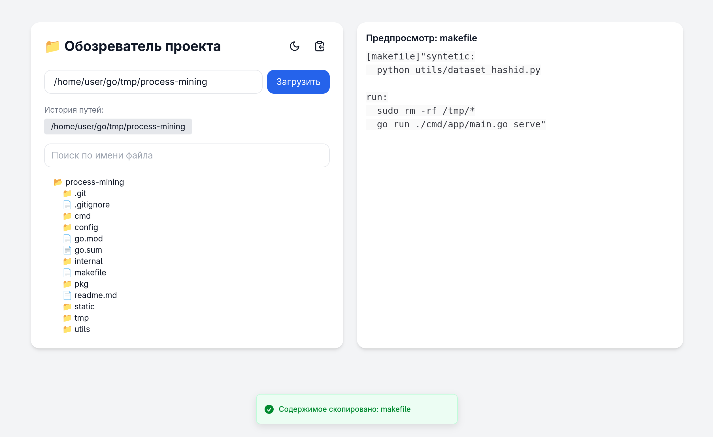

# 📁 Project File Reader – Визуальный обозреватель структуры проектов

## 🧩 Описание
**Project File Reader** — это локальное приложение с приятным UI, которое позволяет:

- Просматривать дерево файлов и папок выбранного проекта
- Получать содержимое любого файла одним кликом
- Сразу копировать содержимое в буфер обмена в виде:

  ```
  [имя_файла.расширение]"содержимое файла"
  ```

- Фильтровать файлы по имени
- Просматривать содержимое с подсветкой синтаксиса
- Сохранять историю путей
- Копировать всё содержимое проекта одной кнопкой
- Переключаться между светлой и тёмной темой

Приложение работает локально на `localhost`, без внешних API.

---

## 🛠️ Установка и запуск

### 📦 Зависимости
- Go 1.16+
- Node.js + npm

### 🚀 Быстрый старт
```bash
chmod +x run.sh
./run.sh
```

- Сервер Go запустится на `http://localhost:8080`
- Фронтенд откроется на `http://localhost:5173`

---

## 🌐 Интерфейс



---

## 🧠 Как использовать

1. Укажите путь к корню проекта (например, `/home/user/dev/myapp`)
2. Нажмите **Загрузить**
3. Кликните по любому файлу — его содержимое будет скопировано в буфер и отобразится с подсветкой
4. Используйте фильтр по имени файла
5. Кнопка 📋 в заголовке — копирует всё содержимое проекта
6. Путь сохраняется в истории — кликайте по ним для быстрого доступа

---

> Проект создавался как инструмент для себя, если имеются предложения, то буду рад их выслушать
